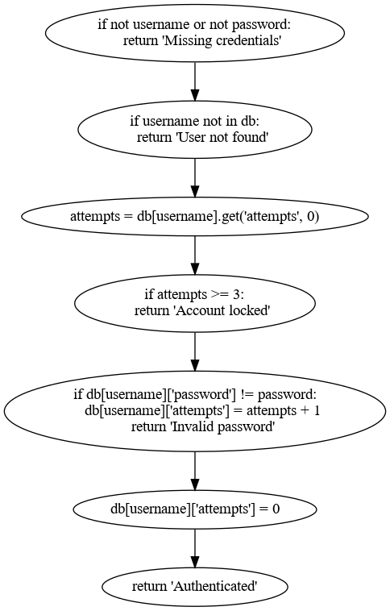

# Репозиторій для демонстрації технік тест-дизайну білої скриньки

**Техніки тест-дизайну білої скриньки (White-box test design techniques)** — це методи створення тест-кейсів, засновані на аналізі внутрішньої структури коду, включаючи перевірку логіки, гілок, умов, циклів і шляхів у програмі, тобто — на аналізі графу управління програмою (Control Flow Graph).

Даний репозиторій складається з:
- [`auth.py`](auth.py) — основний код, який тестуватиметься
- [`requirements.txt`](requirements.txt) — вимоги для запуску коду
- [`test_auth.py`](test_auth.py) — тести для основного коду
- [`cfg.py`](cfg.py) — код для створення графу потоку управління (Control Flow Graph)
- [`.coveragerc`](.coveragerc) — налаштування для coverage.py
- [`.github/workflows/ci.yml`](.github/workflows/ci.yml) — CI-пайплайн для тестування у GitHub Actions
- [`.gitignore`](.gitignore) — вказує Git, які файли та каталоги ігнорувати
- [`README.md`](README.md) — даний Readme-файл

## Граф потоку управління (CFG)

На даному графі потоку управління видно, що програма має 7 вузлів, кожен з яких виконується послідовно, без додаткових розгалуджень. Цикломатична складність програми — 1.

## Звіт про покриття тестами (Coverage report)

Посилання на звіт у форматі html: [Coverage report](https://k05ty.github.io/my-white-box-testing-lab)

Покриття основного коду тестами дорівнює 100%.

## Список шляхів виконання

Список шляхів виконання виводиться під час роботи `cfg.py`, разом з цикломатичною складністю.
